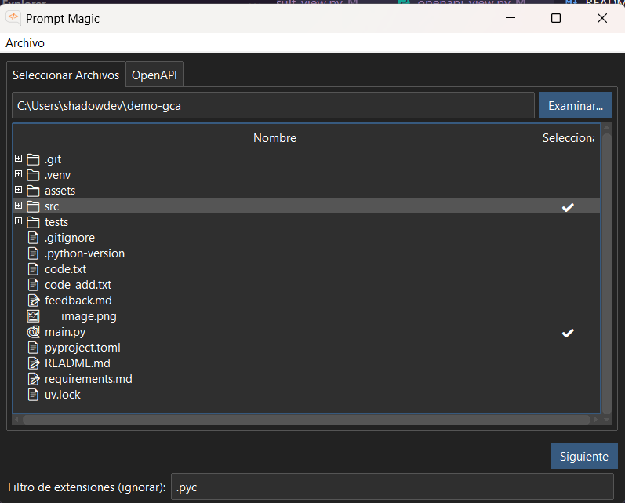

# ✨ Prompt Magic ✨

Una herramienta de escritorio diseñada para simplificar la creación de prompts complejos para modelos de IA. Con Prompt Magic, puedes seleccionar fácilmente archivos y directorios de tu proyecto, y la aplicación consolidará su contenido en un único prompt listo para ser utilizado.

<video controls src="assets/videoDemo.mp4" title="Title"></video>

## 🚀 Características Principales

*   **Explorador de Archivos Intuitivo**: Navega por tus directorios y visualiza la estructura de tu proyecto con emojis que identifican cada tipo de archivo. 📁
*   **Selección Múltiple**: Elige múltiples archivos y carpetas. Si seleccionas una carpeta, todos los archivos que contiene serán incluidos.
*   **Contenido Consolidado**: La aplicación lee el contenido de todos los archivos seleccionados y lo formatea en Markdown, listo para ser insertado en tu prompt.
*   **Plantillas de Prompt**: Usa una plantilla personalizable donde la etiqueta `{context}` será reemplazada por el contenido de los archivos.
*   **Refresco Dinámico**: ¿Has modificado un archivo después de seleccionarlo? ¡No hay problema! El botón "Refrescar" actualiza el contenido del prompt sin que tengas que volver a empezar. 🔄
*   **Filtro por Extensión**: Excluye fácilmente archivos que no necesitas en tu contexto, como `.log`, `.tmp`, etc.
*   **Copia Fácil**: Copia el prompt generado al portapapeles con un solo clic.
*   **Plugin OpenAPI**: Añade especificaciones de API directamente desde una URL para incluirlas en el contexto.
*   **Interfaz Moderna**: Construida con `ttkbootstrap` para una apariencia limpia y agradable.
*   **Soporte Multi-idioma**: La estructura está preparada para añadir más idiomas fácilmente (actualmente en español).

## 🛠️ ¿Cómo Funciona?

El flujo de trabajo es muy sencillo:

1.  **Selecciona tu Proyecto**: Abre la carpeta de tu proyecto usando el botón "Examinar...".
2.  **Elige los Archivos**: Haz clic en los archivos o carpetas que quieres incluir en el contexto. Una marca `✔` aparecerá junto a los elementos seleccionados.
3.  **Filtra si es Necesario**: En la parte inferior, puedes escribir una lista de extensiones de archivo a ignorar, separadas por comas (ej: `.log, .tmp, .env`).
4.  **Genera el Contexto**: Pulsa "Siguiente". Esto te llevará a la vista de composición del prompt.
5.  **Define tu Instrucción**: Edita la plantilla del prompt. El marcador `{context}` es donde se insertará todo el código y contenido de los archivos que seleccionaste.
6.  **Obtén el Prompt Final**: Haz clic en "Obtener Prompt". Verás el resultado final con todo el contenido integrado. Desde aquí puedes:
    *   **Copiar** el resultado.
    *   **Refrescar** el contenido si los archivos originales han cambiado.
    *   **Regresar** para editar la plantilla.
    *   **Crear un nuevo prompt** desde cero.



## ⚙️ Instalación y Puesta en Marcha

Para ejecutar este proyecto en tu máquina local, sigue estos pasos:

1.  **Clona el repositorio:**
    ```bash
    git clone https://github.com/tu-usuario/prompt-magic.git
    cd prompt-magic
    ```

2.  **Crea un entorno virtual (recomendado):**
    ```bash
    python -m venv venv
    source venv/bin/activate  # En Windows usa `venv\Scripts\activate`
    ```

3.  **Instala las dependencias:**
    El proyecto requiere las siguientes librerías de Python. Puedes instalarlas con pip.

    ```bash
    pip install ttkbootstrap requests
    ```

4.  **Ejecuta la aplicación:**
    ```bash
    python main.py
    ```

## 📂 Estructura del Proyecto

El código está organizado de manera modular para facilitar su mantenimiento y extensión.

```
.
├── main.py             # Punto de entrada de la aplicación.
└── src/
    ├── config/
    │   └── strings.py      # Cadenas de texto para la UI (soporte i18n).
    ├── core/
    │   ├── app_state.py    # Gestiona el estado global de la aplicación.
    │   ├── file_tree.py    # Lógica para el árbol de archivos y contenido.
    │   ├── emoji_assigner.py # Asigna emojis a las extensiones.
    │   ├── language_manager.py # Gestiona los idiomas.
    │   └── temp_storage.py   # Almacenamiento temporal para el refresco.
    ├── plugins/
    │   └── openapi/        # Plugin de ejemplo para OpenAPI.
    └── ui/
        ├── main_window.py  # Ventana principal y layout.
        ├── file_selection_view.py # Vista del explorador de archivos.
        ├── prompt_view.py  # Vista para componer el prompt.
        ├── result_view.py  # Vista para mostrar el resultado final.
        └── ui_plugins/
            └── openapi_view.py # UI para el plugin de OpenAPI.
```

## 🔮 Posibles Mejoras a Futuro

*   [ ] Añadir soporte para más idiomas (ej. inglés).
*   [ ] Desarrollar más plugins (ej. para obtener contenido de una URL, de un gist, etc.).
*   [ ] Guardar y cargar plantillas de prompts personalizadas.
*   [ ] Integrar un contador de tokens (OpenAI, Anthropic, etc.).
*   [ ] Permitir arrastrar y soltar carpetas directamente en la ventana.
*   [ ] Crear un ejecutable (`.exe`, `.app`) para una distribución más sencilla.

## 📄 Licencia

Este proyecto está bajo la Licencia MIT. Consulta el archivo `LICENSE` para más detalles.